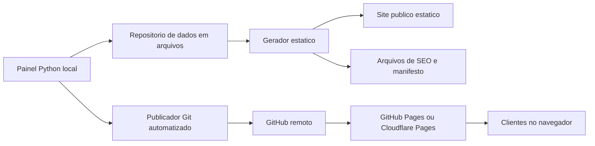
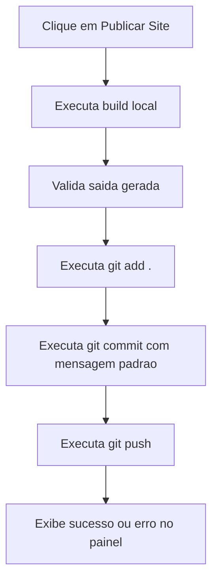

## 1. Desenho da Arquitetura


## 2. Descricao da Solucao
- Frontend publico: HTML5 + CSS3 + JavaScript puro, sem frameworks.
- Painel administrativo: Python 3 com interface desktop local.
- Persistencia: JSON para metadados e sistema de arquivos para imagens.
- Geracao: scripts Python para construir os artefatos publicos a partir dos dados mestre.
- Publicacao: integracao com Git local usando subprocess controlado pelo painel.

## 3. Estrutura Completa de Diretorios
```text
envio_de_ofertas/
├── .trae/
│   └── documents/
│       ├── prd-site-ofertas-stories.md
│       └── arquitetura-tecnica-site-ofertas-stories.md
├── admin/
│   ├── app.py
│   ├── ui/
│   │   ├── main_window.py
│   │   ├── offer_form.py
│   │   ├── offer_list.py
│   │   ├── filters_bar.py
│   │   └── publish_panel.py
│   ├── services/
│   │   ├── offer_service.py
│   │   ├── publish_service.py
│   │   ├── image_service.py
│   │   └── site_builder_service.py
│   ├── core/
│   │   ├── config.py
│   │   ├── paths.py
│   │   ├── validators.py
│   │   └── git_runner.py
│   └── models/
│       └── offer.py
├── assets/
│   ├── icons/
│   ├── favicon/
│   └── brand/
├── config/
│   ├── site.json
│   └── publishing.json
├── data/
│   ├── offers.json
│   └── generated/
│       └── public-offers.json
├── ofertas/
│   ├── originals/
│   └── optimized/
├── scripts/
│   ├── build_site.py
│   ├── optimize_images.py
│   └── publish_site.py
├── site/
│   ├── index.html
│   ├── ofertas.json
│   ├── robots.txt
│   ├── sitemap.xml
│   ├── manifest.webmanifest
│   ├── favicon.ico
│   ├── assets/
│   │   ├── css/
│   │   │   └── main.css
│   │   ├── js/
│   │   │   ├── app.js
│   │   │   ├── story-viewer.js
│   │   │   ├── gestures.js
│   │   │   └── seo.js
│   │   └── img/
│   └── ofertas/
├── templates/
│   ├── index.template.html
│   ├── manifest.template.json
│   ├── robots.template.txt
│   └── sitemap.template.xml
├── tests/
│   ├── test_offer_filters.py
│   ├── test_site_builder.py
│   └── test_publish_service.py
├── README.md
├── requirements.txt
└── .gitignore
```

## 4. Responsabilidades por Camada
| Camada | Responsabilidade |
|-------|------------------|
| `admin/ui` | Interface grafica do administrador, eventos de tela e feedback visual |
| `admin/services` | Regras de negocio, orquestracao de arquivos, build e publicacao |
| `admin/core` | Configuracoes, caminhos, validacoes e integracao com Git |
| `admin/models` | Estruturas tipadas e utilitarios de serializacao |
| `data` | Fonte canonica dos metadados das ofertas |
| `ofertas` | Armazenamento fisico de imagens originais e otimizadas |
| `templates` | Moldes dos arquivos estaticos gerados |
| `site` | Saida final publicada no GitHub Pages |

## 5. Definicoes de Rotas e Superficies
| Rota ou entrada | Finalidade |
|----------------|------------|
| `/` | Viewer publico de ofertas em formato Stories |
| `admin/app.py` | Inicializacao do painel administrativo local |

## 6. Modelo de Dados
### 6.1 Estrutura da Oferta
```json
{
  "id": "20260721-001",
  "slug": "alho-roxo",
  "titulo": "Alho Roxo",
  "imagem_original": "ofertas/originals/alho-roxo.jpg",
  "imagem_publica": "ofertas/alho-roxo.webp",
  "inicio": "2026-07-20",
  "fim": "2026-07-25",
  "ativo": true,
  "ordem": 1,
  "criado_em": "2026-07-21T10:30:00",
  "atualizado_em": "2026-07-21T10:30:00"
}
```

### 6.2 Regras de Dados
- `id` unico gerado pelo sistema para evitar colisao.
- `slug` derivado do titulo para nomear arquivos e URLs internas.
- `ativo` permite desabilitar ofertas antes do vencimento.
- Ofertas publicas sao aquelas com `ativo = true`, `inicio <= hoje` e `fim >= hoje`.
- O JSON publico contem apenas os campos necessarios ao site, reduzindo payload.

## 7. Fluxo de Geracao Estatica
1. Ler `data/offers.json`.
2. Validar campos obrigatorios e consistencia das datas.
3. Filtrar ofertas ativas e nao expiradas.
4. Ordenar por `ordem`, data de inicio e data de criacao.
5. Otimizar ou reaproveitar imagens em `ofertas/optimized`.
6. Gerar `site/ofertas.json` com payload enxuto.
7. Renderizar `site/index.html` e arquivos auxiliares a partir de `templates/`.
8. Atualizar `robots.txt`, `sitemap.xml`, `manifest.webmanifest` e favicon.

## 8. Fluxo de Publicacao Automatizada


## 9. Estrategia de Performance
- Gerar imagens publicas em WebP ou JPEG otimizado com largura padrao para tela mobile.
- Aplicar `loading="lazy"` em imagens nao imediatas e preload somente da proxima oferta.
- Reduzir JavaScript a modulos pequenos, sem dependencias pesadas.
- Usar CSS enxuto, variaveis de tema e animacoes com `transform` e `opacity`.
- Evitar renderizacao desnecessaria e manter apenas poucas ofertas vivas na memoria.

## 10. SEO e Metadados
- `meta description` configuravel por arquivo de configuracao.
- Open Graph para titulo, descricao, URL canonica e imagem padrao.
- `manifest.webmanifest` para experiencia instalavel.
- `robots.txt` e `sitemap.xml` gerados automaticamente com base na URL configurada.
- Favicon derivado dos ativos de marca em `assets/favicon`.

## 11. Riscos e Mitigacoes
| Risco | Mitigacao |
|------|-----------|
| Git nao configurado na maquina do administrador | Validacao inicial no painel com mensagem orientativa |
| Imagens muito pesadas | Pipeline de otimizacao antes da geracao publica |
| Publicacao falhar por credenciais | Captura do erro do Git e orientacao no painel |
| JSON corrompido por edicao manual | Leitura validada e backup automatizado antes de salvar |
| Muitas ofertas carregadas ao mesmo tempo | Renderizacao incremental com virtualizacao leve |

## 12. Plano de Implementacao por Etapas
1. **Base do repositorio**: criar diretorios, arquivos de configuracao, modelos e estrutura de templates.
2. **Nucleo Python**: implementar entidades, validadores, leitura e escrita do JSON e manipulacao de imagens.
3. **Builder estatico**: gerar `site/` a partir de `data/`, incluindo filtro de expiracao e SEO.
4. **Viewer publico**: construir experiencia Stories com swipe, scroll, teclado e transicoes suaves.
5. **Painel administrativo**: montar UI escura moderna com listagem, busca, filtros, preview e CRUD completo.
6. **Publicacao Git**: integrar build + commit + push com feedback no painel.
7. **Qualidade final**: revisar testes focados, responsividade, Lighthouse, limpeza de codigo e documentacao.
