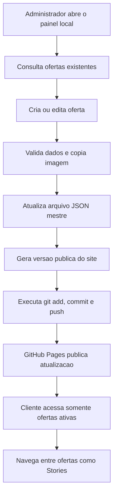

## 1. Visao Geral do Produto
Sistema de divulgacao de ofertas de supermercado com experiencia publica em formato Stories e painel administrativo local em Python, sem banco de dados e sem backend online.
- Resolve a necessidade de publicar ofertas de forma rapida, barata e simples, com hospedagem estatica em GitHub Pages ou Cloudflare Pages.
- Entrega baixo custo operacional, manutencao simples, alta performance no mobile e fluxo de publicacao com um clique para o administrador.

## 2. Funcionalidades Centrais

### 2.1 Papeis de Usuario
| Papel | Metodo de acesso | Permissoes principais |
|------|------------------|-----------------------|
| Cliente | Link publico | Visualizar ofertas ativas em formato Stories |
| Administrador | Aplicativo local em Python | Criar, editar, excluir, filtrar, pesquisar, gerar e publicar o site |

### 2.2 Modulos de Funcionalidade
1. **Site publico**: viewer vertical de ofertas, navegacao por toque, roda do mouse e teclado, indicadores visuais, preload da proxima oferta e SEO tecnico.
2. **Painel administrativo local**: listagem de ofertas, upload por clique ou arrastar e soltar, formulario de cadastro/edicao, pesquisa, filtros, ordenacao e preview.
3. **Gerador estatico**: leitura do JSON mestre, descarte automatico de ofertas expiradas, geracao do JSON publico e arquivos do site.
4. **Publicacao automatica**: execucao de `git add`, `git commit` e `git push` a partir do painel, sem comandos manuais.

### 2.3 Detalhamento de Paginas e Interfaces
| Nome | Modulo | Descricao |
|------|--------|-----------|
| Site publico | Viewer de Stories | Exibe uma oferta por tela, com imagem principal, titulo discreto, contador e navegacao vertical suave |
| Site publico | Camada de interacao | Suporta swipe, scroll, teclado e clique em areas de navegacao |
| Site publico | Estado vazio | Informa de forma elegante quando nao houver ofertas ativas |
| Painel admin | Lista de ofertas | Mostra miniatura, titulo, inicio, fim, status, validade e acoes principais |
| Painel admin | Busca e filtros | Permite pesquisar por titulo, filtrar por status e ordenar por validade ou criacao |
| Painel admin | Formulario de oferta | Recebe imagem, titulo, data inicial e final, com validacao e preview instantaneo |
| Painel admin | Publicacao | Mostra resultado da geracao e do envio ao GitHub com feedback claro |

## 3. Fluxos Principais
O administrador abre o painel local, cadastra ou edita uma oferta, escolhe imagem e periodo de validade, salva os dados e o sistema atualiza o repositrio local. Ao publicar, o gerador monta o site publico, filtra itens expirados, atualiza os arquivos finais e envia tudo para o repositorio remoto.

O cliente acessa o link publico e consome somente ofertas ativas. A navegacao acontece em tela cheia, com transicoes suaves e resposta imediata em celular e desktop.

## 4. Design da Interface
### 4.1 Direcao Visual
- Tema predominante: escuro premium, com base grafite e destaques cobre ou dourado queimado.
- Estilo dos botoes: grandes, com cantos moderadamente arredondados, brilho sutil e estados claros de hover/foco.
- Tipografia: fonte de alto contraste para titulos e fonte altamente legivel para textos de apoio.
- Layout: site publico focado em tela cheia vertical; painel com densidade informacional alta, sem espacos desperdicados.
- Iconografia: simples, elegante e funcional, evitando excesso visual.

### 4.2 Resumo Visual por Interface
| Interface | Modulo | Elementos de UI |
|-----------|--------|-----------------|
| Site publico | Oferta individual | Imagem dominante, overlay em degrad e titulo discreto, contador de progresso e indicador numerico |
| Site publico | Transicoes | Animacoes verticais suaves, snap entre telas e feedback de gesto |
| Painel admin | Lista | Tabela ou grade compacta, miniaturas, badges de status, acoes de editar e excluir |
| Painel admin | Upload | Area drag and drop com destaque visual e preview imediato |
| Painel admin | Publicacao | Botao principal de alto destaque e painel de log resumido |

### 4.3 Responsividade
- Site publico com prioridade para mobile, mantendo comportamento de Stories em Android e iPhone.
- Painel administrativo otimizado para notebook e desktop, com adaptacao funcional para tablets.
- Alvos de toque amplos, suporte a teclado e cuidado com contraste e legibilidade.

## 5. Requisitos Funcionais
- Cadastrar oferta com imagem, titulo, data inicial, data final e identificador unico.
- Editar qualquer oferta existente sem recriar registros manualmente.
- Excluir oferta e opcionalmente remover sua imagem nao utilizada.
- Ignorar automaticamente ofertas expiradas durante a geracao do site publico.
- Permitir pesquisa por titulo e filtros por status, validade e periodo.
- Ordenar ofertas por criacao, inicio, fim e titulo.
- Gerar `dados.json`, `index.html`, `robots.txt`, `sitemap.xml`, `manifest.webmanifest` e metadados de SEO.
- Publicar o site com um clique via Git.

## 6. Requisitos Nao Funcionais
- Site estatico, sem banco de dados e sem backend em producao.
- Alto desempenho, com notas proximas de 100 no Lighthouse.
- JavaScript enxuto, lazy loading de imagens e preload apenas da proxima oferta.
- Estrutura modular, de facil manutencao e pronta para evolucao futura.
- Compatibilidade com GitHub Pages e Cloudflare Pages.

## 7. Escopo Tecnico Confirmado
- Frontend publico: HTML5, CSS3 e JavaScript puro.
- Painel administrativo: Python local, com interface grafica moderna.
- Persistencia: arquivos JSON e imagens organizadas em diretorios.
- Automacao: scripts Python para gerar site, otimizar imagens e publicar via Git.

## 8. Plano de Desenvolvimento em Etapas
1. **Fundacao do projeto**: criar estrutura de diretorios, configuracoes, documentos base e convencoes de dados.
2. **Motor de dados e geracao**: implementar modelo JSON, validacoes, filtragem por validade e gerador do site estatico.
3. **Site publico Stories**: construir layout, navegacao vertical, indicadores, preload e SEO tecnico.
4. **Painel administrativo**: implementar listagem, busca, filtros, upload, preview, cadastro, edicao e exclusao.
5. **Publicacao automatica**: integrar comandos Git com feedback no painel e tratamento de falhas.
6. **Otimizacao final**: revisar performance, acessibilidade, responsividade, limpeza de codigo e documentacao operacional.
